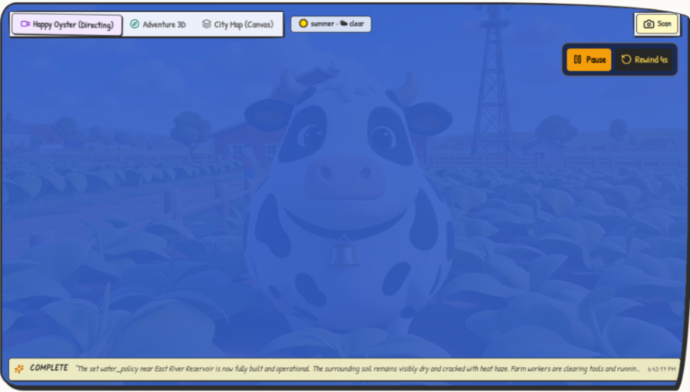
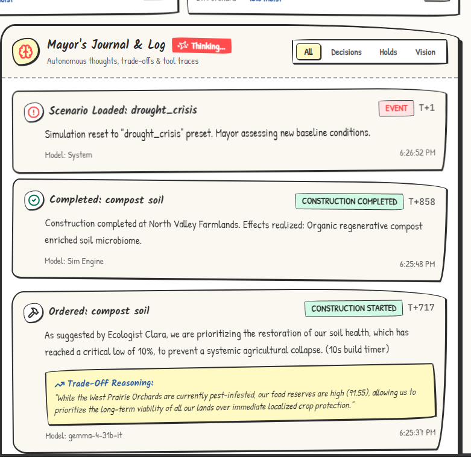
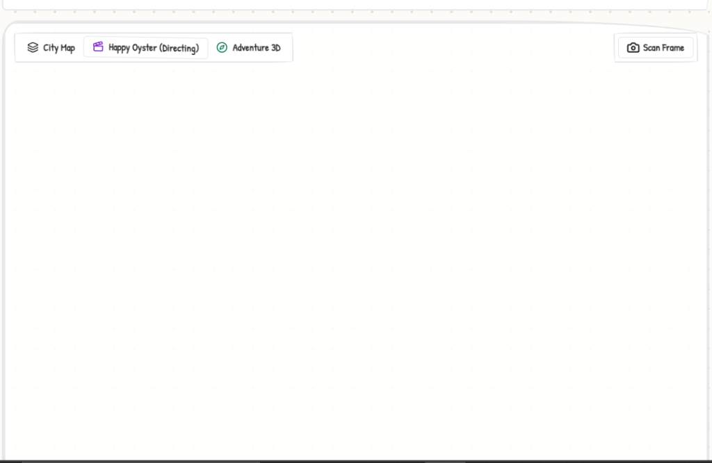

# 🌾 FarmState — Autonomous AI Town Simulation & World Streaming

[](https://reactor.inc)
[](https://ai.google.dev)
[](https://vitejs.dev)
[](https://www.typescriptlang.org)
[](https://tailwindcss.com)

> **FarmState** is a real-time autonomous simulation where an LLM-powered **AI Mayor** manages an organic cartoon farm valley (*Clash of Clans / Farming Simulator* aesthetic), dynamically generating and steering a **real-time 3D generative world model** via **Reactor's Happy Oyster 2.0.0 SDK**.

---

## 📸 Screenshots & Visual Walkthrough

### 1. 🎥 Live 720p Generative World Stream (`@reactor-models/happy-oyster`)
Dynamic cartoon farming world rendered in real-time on Reactor's GPU cluster with zero artifacts and live WebRTC streaming.


### 2. 🧠 Autonomous AI Mayor's Journal & Reasoning Engine
The Mayor autonomously evaluates farm conditions, makes trade-off calculations, and orders construction projects once every minute.


### 3. 🗺️ Real-time 2D Canvas & Multi-District Dashboard
Multi-view architecture with instant toggles between **Happy Oyster Directing**, **3D Adventure**, and the **City Map Canvas**.


---

## ✨ Key Features

- **🎮 Real-Time World Model (Happy Oyster 2.0)**:
  - **Directing Studio**: Text-driven scene steering (`instruct`) that automatically adapts to in-game seasons, weather disasters, and mayor construction orders.
  - **Adventure 3D Mode**: Playable third-person exploration with WASD movement and jump controls.
  - **Persistent Streaming**: Streams stay alive in the background across tab switches without unmounting or reconnecting.

- **🤖 Autonomous AI Mayor**:
  - Powered by **Google Gemini / Gemma 4 31B**.
  - Paced strictly to **1 decision every 60 seconds** to preserve API credits and provide clear story progression.
  - Structured JSON outputs with strict trade-off reasoning, confidence scores, and construction queues.

- **🌾 Realistic Simulation Dynamics**:
  - **Water Resourcing**: Evaporation curves, seasonal rainfall replenishment, and irrigation canal drainage.
  - **Agricultural Yields**: Dynamic food production tied to healthy croplands, orchards, greenhouses, and soil moisture multipliers.
  - **Seasonal & Weather Cycles**: Smooth 3-minute season transitions (Spring, Summer, Fall, Winter) and 2-minute weather stability.

- **🎨 Hand-Drawn Sketch Aesthetic**:
  - Custom notebook post-it theme with wobbly borders, pencil sketch strokes, and Patrick Hand / Kalam typography.

---

## 🏗️ Architecture Overview

```mermaid
graph TD
    A[Simulation Engine (1s tick)] -->|State Updates| B[Express + Socket.io Server]
    B -->|Broadcasts State| C[React 18 Frontend]
    B -->|Every 60s| D[AI Mayor (Gemma 4 31B)]
    D -->|Autonomous Decision| B
    B -->|Mint JWT| E[Reactor API]
    C -->|WebRTC / ARTC Stream| F[Happy Oyster 2.0 World Model]
    C -->|Instruct Scenes| F
```

---

## 🚀 Quickstart & Installation

### 1. Prerequisites
- **Node.js**: v18.0.0 or higher
- **npm** or **yarn**
- **Reactor API Key**: Obtain from [Reactor.inc](https://reactor.inc)
- **Google Gemini API Key**: Obtain from [Google AI Studio](https://aistudio.google.com)

### 2. Clone the Repository
```bash
git clone <YOUR_GITHUB_REPO_URL>
cd reactor
```

### 3. Install Dependencies
```bash
# Install root, backend, and frontend packages
npm install
cd backend && npm install
cd ../frontend && npm install
cd ..
```

### 4. Configure Environment Variables
Create a `.env` file inside the `backend/` directory:

```env
# backend/.env
PORT=3001
GEMINI_API_KEY=your_gemini_api_key_here
REACTOR_API_KEY=your_reactor_api_key_here
```

### 5. Run the Application
Start both the backend server and frontend development server concurrently:

```bash
npm run dev
```

- **Frontend Application**: `http://localhost:5173/`
- **Backend API**: `http://localhost:3001/`

---

## 📂 Project Structure

```
reactor/
├── backend/
│   ├── src/
│   │   ├── agent/            # AI Mayor LLM prompt & decision parsing (Gemini/Gemma)
│   │   ├── engine/           # SimEngine (resource math, water, food, districts)
│   │   ├── reactor/          # Reactor token minting service
│   │   └── server.ts         # Express & Socket.io server (1-min decision cycle)
│   └── package.json
├── frontend/
│   ├── src/
│   │   ├── components/
│   │   │   ├── ReactorView.tsx      # Happy Oyster 2.0 Directing & Adventure Studio
│   │   │   ├── Dashboard.tsx        # Resource gauges & metric history charts
│   │   │   ├── MayorLog.tsx         # AI Mayor autonomous thoughts & trade-offs
│   │   │   └── Navbar.tsx           # Scenario selector & speed controls
│   │   ├── App.tsx
│   │   └── index.css                # Hand-drawn sketch design tokens
│   └── package.json
├── docs/
│   └── screenshots/          # Embedded website screenshots
├── .gitignore
├── package.json
└── README.md
```

---

## 📜 License
MIT License. Built with ❤️ using Reactor and Google Generative AI.
